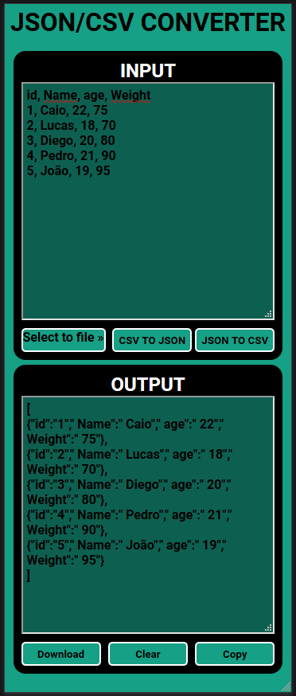
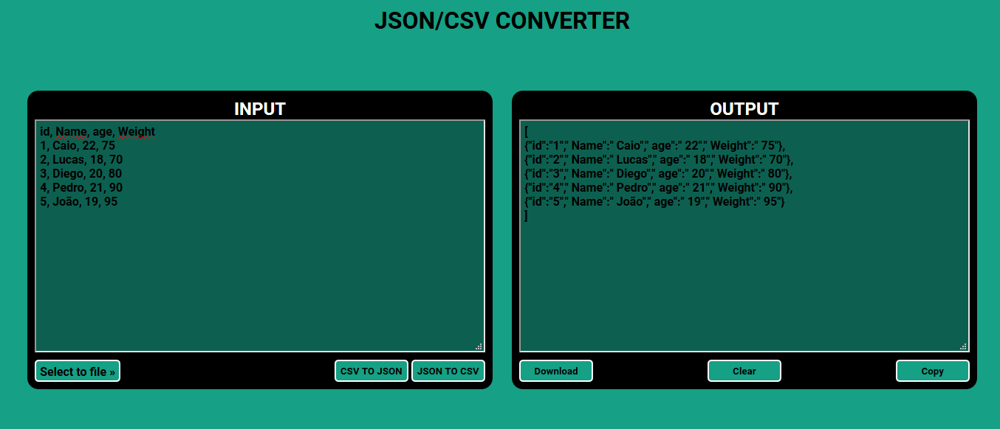

<h1 align="center">JSON/CSV CONVERTER</h1>

  

<h2 align="center">Conversor de CSV e JSON, podendo importar ou exportar arquivo de leitura</h2>

<strong><a href="https://caiohenriquemachado.github.io/JsonToCsv/index.html">ACESSAR SITE</a></strong>

 

<h1 align="center">Mobile Version</h1>

  

<h1 align="center">Web responsive Version </h1>

  

 

 
  <h2 align="center">FEATURES :book:</h2>
 

- 🟠 **HTML5** 		      - Para construir a estrutura do site.
- 🟣 **CSS3** 	        - Para a estilização e personalização das estruturas no site.
- 🟡 **JavaScript**     - Para inserir lógica.
- 🟡 **File converter** - Para inserir baixar o arquivo.

 